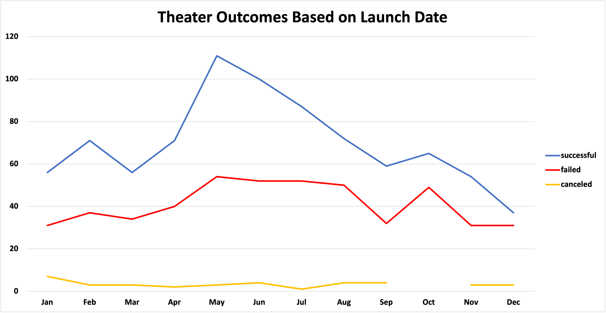
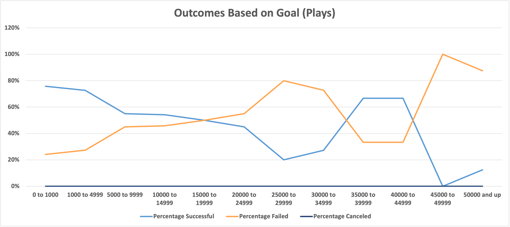

# Kickstarter_Challenge
Performing Analysis on Kickstarter Data to uncover trends

## Overview/Purpose of the project
The purpose of this project was to examine how different campaigns fared in relation to their launch dates and their funding goals after Louise’s play Fever came close to its fundraising goal in a short amount of time.  

## Analysis and Challenges
In order to provide Louise a measured explanation, an analysis of Theatre kickstarter trends from 2012 to 2017 was conducted. Specific factors such as launch date of Theater Kickstarters and the funding goals set for the subcategory "Plays" were examined in order to measure their impact on success and failure outcomes. Although there were no challenges that needed to be overcome when performing this analysis, one could easily make a mistake by not taking a step back and remembering why the anlaysis is being conducted in the first place. While it's great to have a micro level view of data to prevent mistakes in calculations, it's very important to remember the overall goal.  

### Analysis of Outcomes Based on Launch Date
Since Launch date may have been a critical factor in determining success or failure for Theatre Kickstarters, an analysis was conducted on outcomes based on Launch Date. Moreover, using data from 2012 to 2017, the grand total for success, failure, and cancelations was calculated for each month in order to determine which month was more favorable for launching Theater Kickstarters and vice versa. As seen in the below line chart, the month of May had the highest amounth of successful Theatre Kickstarer Launches (111) when compared to the other months. However, May also accounted for the most amount of failures (54).   

### Analysis of Outcomes Based on Goals
Since Louise's Kickstarter Campaign was specifically in the "Play" subcategory, an analysis was conducted on outcomes of plays based on the pledge Goal. Once again using data from 2012 to 2017, the Goal amounts for play kickstarter campaigns were broken down into specific ranges to determine which had higher percentages of success or failure. As seen in the line chart below, success percentages were highest between 35000 to 44999 before significantly dropping. 

### Challenges and Difficulties Encountered
As mentioned above, although there were no challenges or difficulties encountered while conducting this analysis, it can be very easy to get caught up in the numbers, specifically calcuations, application of proper formulas, and chart presentation. All these factors can distract from remembering the overall goal of the analysis.   

## Results

- There are two conclusions that can be drawn from the outcomes of Theatre Kickstarter campaigns based on Launch Date. First, due to the low amount of cancelation outcomes, one can rest easy knowing that Theater kickstarter campaigns will be seldom canceled throughout the year, with January having the highest probability. Second, the ideal timeframe to launch a Theater kickstarter campaign is in the late spring to early summer based on the amount of successful outcomes. However, it is important to recognize that the amount of failures were also the highest at this time. This leads us to the limitations in the data analysis. In order to get more of a concrete picture, we could have created another chart depicting percentages of success for Theatre Kickstarter campaigns for each month. For instance, after conducting further calculations and taking failures into consideration, it was determined only 66% of Theater kickstarter campaigns were actually successful in the month of May which is only a 6% increase from January (60%).     

- Separately, regarding outcomes vs Goals for the "Plays" subcategory, we can conclude that maintaing pledge goals from 35000 to 44999 would be ideal in order to ensure a successful outcome. Additionally, any goal between 25000 to 29999 and past 45000 is to be avoided. However, due to only one project being in the 45000 to 49999 range, we need more data to make a definite determiniation.  

- Of note, there are certainly limitations in the dataset. One main limitation is recency. The data is approximately 5 years old which may not present a clear present picture. Using 5 year old data can cause errors when trying to forecast future success. which  musical and spaces subcategory comparison, percentages

- Finally, there are undoubtedly additional charts we could have created. As mentioned previously, we could have demonstrated the percentages of success for Theater kickstarter campaigns. Additionally, one chart that would have been beneficial is a chart comparing Plays to the two other Theater subcategories which were "musical" and "spaces" as this would have determined which subcategory was more successful. See below excel file for the full spreadsheeet. 

[filename](path/to/filename.xlxs)

